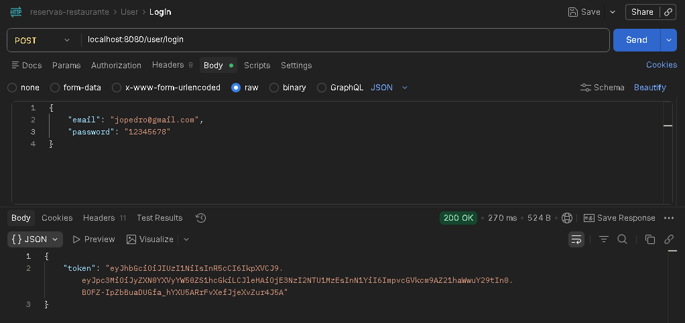
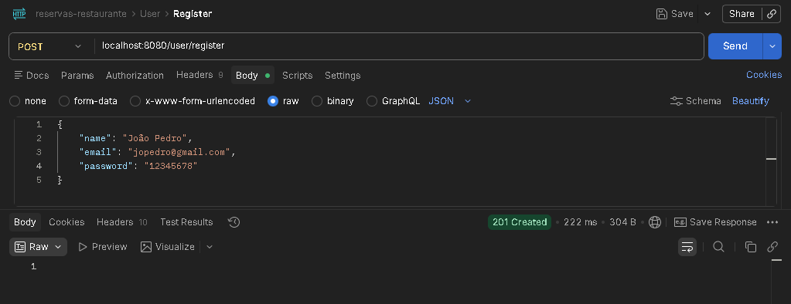
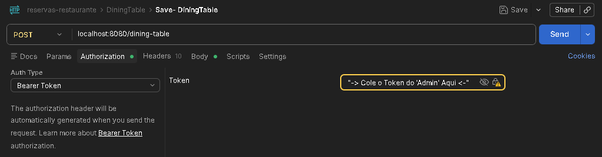
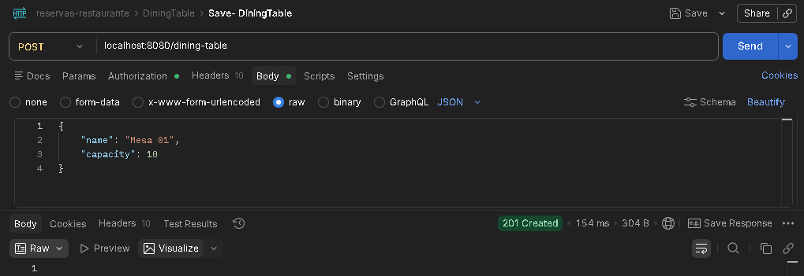
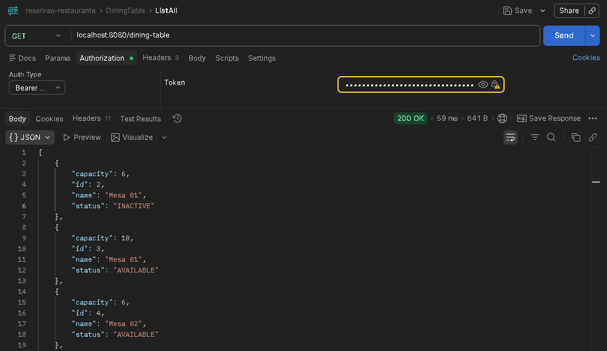
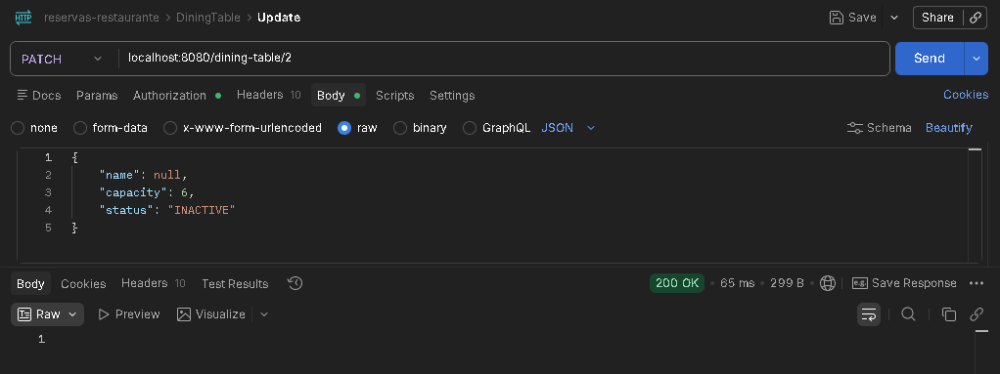
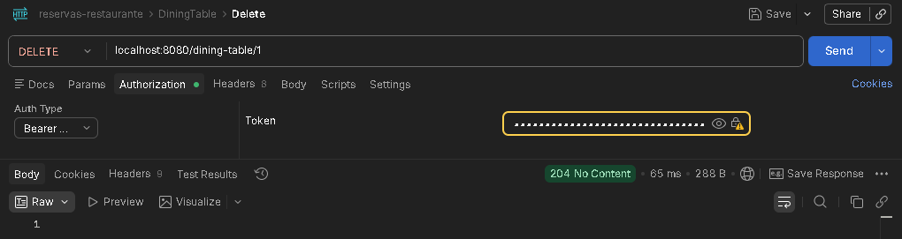
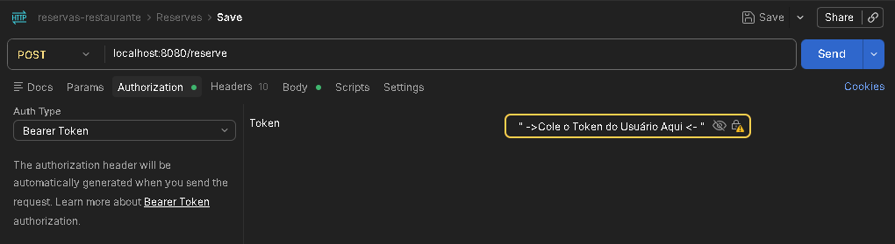
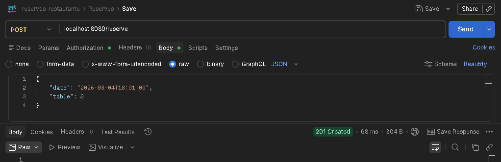
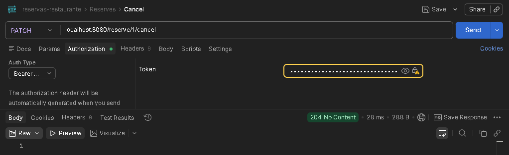

# Sistema de Reservas de Restaurante
<p align="center">
  
  
  
</p>

## Descrição
O Sistema de Reservas de Restaurante é uma API REST desenvolvida em Java com Spring Boot,criada a partir do desafio [Desafio de Programação: Desafio: Sistema de Reservas de Restaurante](https://racoelho.com.br/listas/desafios/sistema-de-reservas-de-restaurante).

O objetivo é implementar funcionalidades comuns de um sistema real de reservas, incluindo:

- Autenticação de usuários

- Validação de horários disponíveis

- Gerenciamento de mesas

- Registro de reservas

- Controle de acesso por perfil de usuário

## Tecnologias

- **Java 17**

- **Spring Boot**
    - Spring Web
    - Spring Data JPA
    - Spring Security

- **H2 (Banco em memória)**

- **Autenticação**: JWT 

- **Maven**

## Funcionalidades 
- Cadastro e login de usuários (CLIENT ou ADMIN)
- CRUD de mesas (apenas ADMIN)
- Criação, listagem e cancelamento de reservas
- Validações de negócio:
    - Reserva apenas para datas futuras (mínimo 1h de antecedência)
    - Mesas devem estar ativas
    - Evita sobreposição de reservas na mesma mesa
- Tratamento de exceções centralizado via @ControllerAdvice
- Retorno de mensagens claras via DTO (ExceptionDTO)

## Endpoints

### Usuário 
| Método | Endpoint          | Descrição         | Autorização|
| ------ | ----------------- | ---------------- | ---------- |
| POST   | `/user/register` | Criar um usuário | Público    |
| POST   | `/user/login`     | Logar usuário    | Público    |
### Reservas
| Método | Endpoint               | Descrição                  | Autorização |
| ------ | ---------------------- | -------------------------- | ----------- |
| POST   | `/reserve`             | Criar reserva              | CLIENT      |
| GET    | `/reserve`             | Listar reservas do usuário | CLIENT      |
| PATCH  | `/reserve/{id}/cancel` | Cancelar reserva           | CLIENT      |
### Mesas
| Método | Endpoint             | Descrição      | Autorização   |
| ------ | -------------------- | -------------- | ------------- |
| GET    | `/dining-table`      | Listar mesas   | CLIENT, ADMIN |
| POST   | `/dining-table`      | Criar mesa     | ADMIN         |
| PATCH  | `/dining-table/{id}` | Atualizar mesa | ADMIN         |
| DELETE | `/dining-table/{id}` | Deletar mesa   | ADMIN         |

## Como Rodar?

1. Clone o repositório 
    ``` bash
    https://github.com/JoaoPSCalazans/sistema-de-reservas-de-restaurante.git
    ```
2. Configure `application.properties`(**Opcional!:** ele já vem com pré-configurações)

3. Rode via Maven:
    ```bash
        mvn spring-boot:run
        ou
        .\mvnw spring-boot:run
    ```
4. Use o Postman ou outra ferramenta para testar os endpoints

---
##  Usuário ADMIN padrão

Criado automaticamente via `CommandLineRunner`.

- **Email:** `admin@email.com`
- **Senha:** `123456`

> Use este usuário para acessar endpoints restritos como `/dining-table/**`

> O endpoint /h2-console não precisa de autenticação!!

## Exemplos de JSON para request/response

### Usuário




### Mesa







### Reserva



