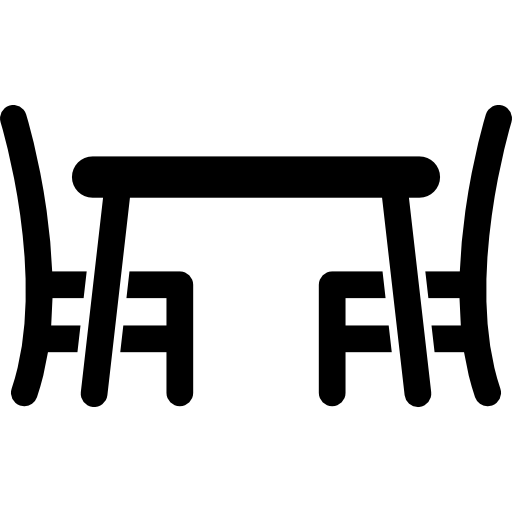
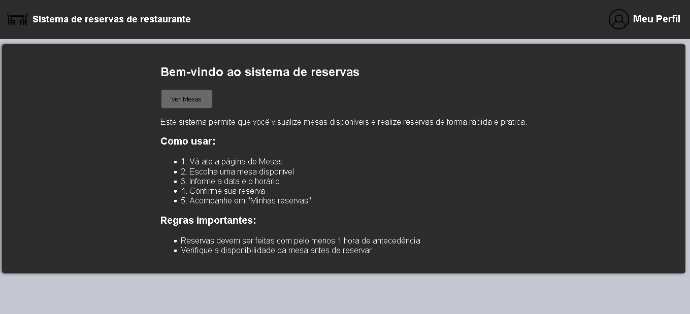
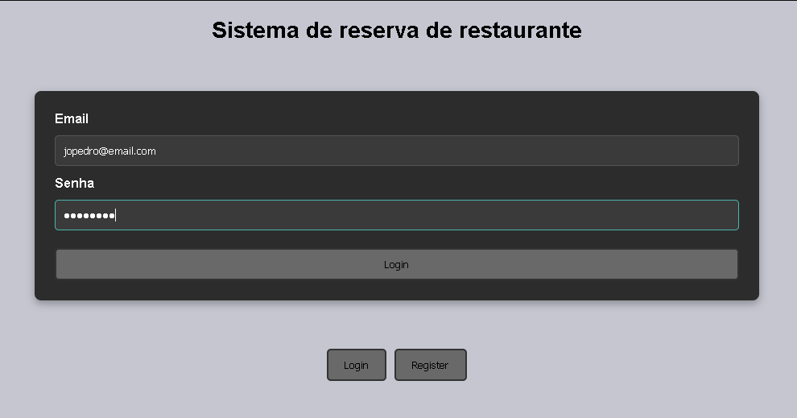
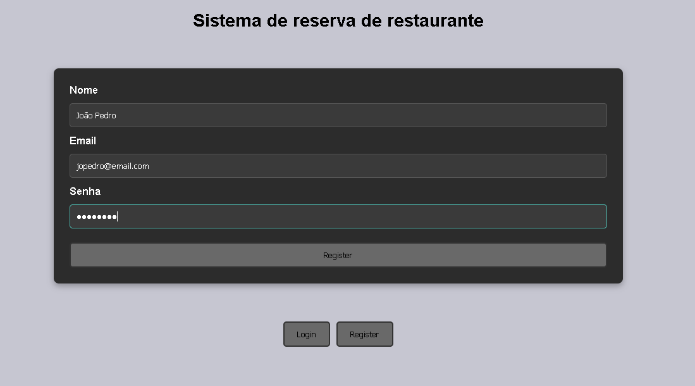
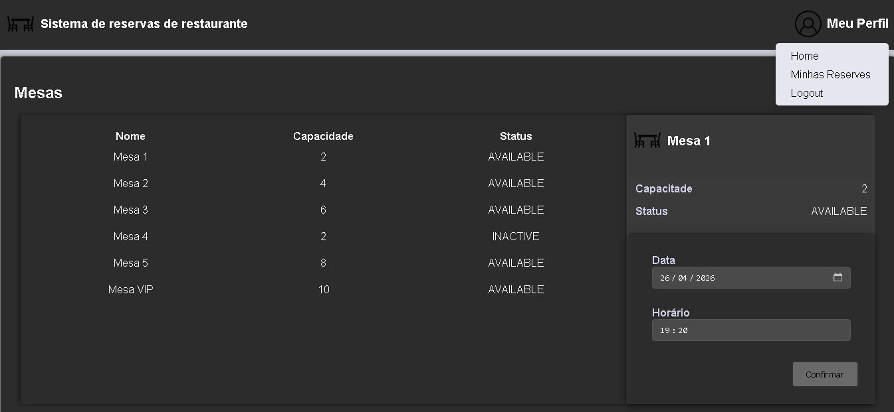
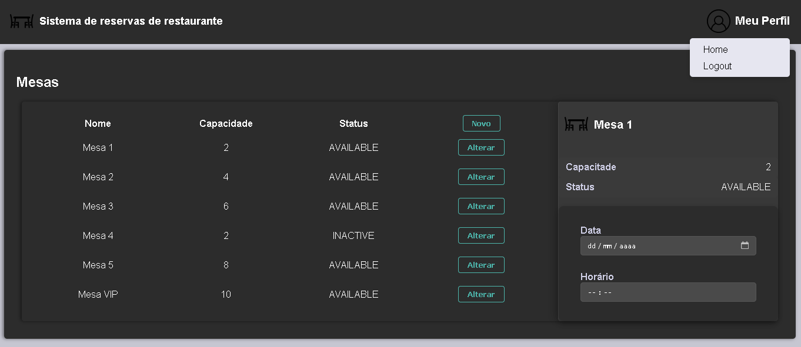
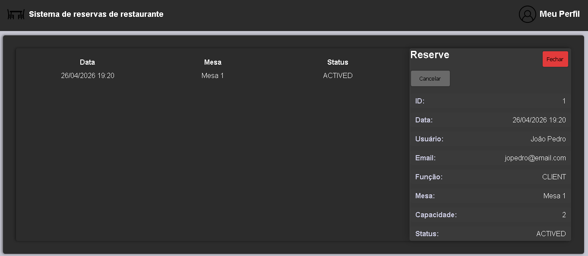

<div align="center">

<br><br>

# Sistema de Reservas de Restaurante


</div>

##  💻 Sobre o Projeto


O Sistema de Reservas de Restaurante é um projeto desenvolvido com o objetivo de aplicar, na prática, conceitos de Spring Security em um cenário real.

O sistema implementa funcionalidades comuns de aplicações de reservas, incluindo autenticação de usuários, validação de dados e controle de disponibilidade de horários.

Este projeto foi inspirado no desafio:
🔗 [Desafio: Sistema de Reservas de Restaurante](https://racoelho.com.br/listas/desafios/sistema-de-reservas-de-restaurante)

## 🚀 Tecnologias

- **Java 17**
- **Angular 18**
- **H2 Database**
- **Spring Boot**
  - Spring Data JPA
  - Spring Security
  - Spring Web
- **Validation**
- **JWT**
- **Maven**

## 🔧 Funcionalidades
1. **Autenticação de Usuário**
    - **Registro**: Usuário é capaz se registrar com um nome, e-mail e senha.
    - **Login**: Após realizar login recebe um token JWT para acesso às funcionalidades.
    - **Restrição de Acesso**: Apenas usuários logados tem acesso às funcionalidades.

2. **Gestão de Mesas**
    - **Listagem**: Listar todas as mesas disponíveis no restaurante.
    - **Criar Mesa**: Somente administradores podem adicionar novas mesas ao sistema com um nome e capacidade de pessoas.
    - **Editar Mesa**:Somente administradores podem alterar mesas existentes no sistema.
    - **Excluir Mesa**:Somente administradores podem excluir mesas existentes no sistema.
    - **Status da Mesa**: Cada mesa pode estar disponível ou inativa o que impossibilita o usuário de fazer uma reserva a mesa.

3. **Sistema de Reservas**
    - **Criar Reserva**: Somente usuários autenticados podem criar reservas para mesas específicas.
    - **Verificar Disponibilidade**:
        - Reserva apenas para datas futuras (mínimo 1h de antecedência)
        - Mesas devem estar ativas
        - Evita sobreposição de reservas na mesma mesa(cada reserva possui um intervalo fixo de 2 horas)
    - **Cancelar Reserva**: Usuários podem cancelar suas reservas, o que libera a mesa para novas reservas.

## 🕹️ Como Rodar?

1. Clone o repositório
```
 https://github.com/JoaoPSCalazans/sistema-de-reservas-de-restaurante.git
```
2. Entre na pasta `restaurante-api`:
```bash
 cd restaurante-api
```
3. Configure application.properties (**Opcional**!: ele já vem com pré-configurações)

4. Rode via Maven:
```
mvn spring-boot:run
        ou
.\mvnw spring-boot:run
```

5. Acessa o site na url: `http://localhost:8080`

### Usuário ADMIN padrão

Criado automaticamente via CommandLineRunner.
- **Email**: `admin@email.com`
- **Senha**: `123456`

> O endpoint /h2-console não precisa de autenticação!!

## 📸 Exemplos

### 🏠 Home


### 🔐 Login e Registro



### 📋 Listagem de Mesas
> USUÀRIO:


> ADMIN:
 

### 📅 Criação de Reserva



## 🧠 Estrutura do Backend

```text
src/
 └── main/
     └── java/
         └── com/restaurante/api/
             ├── controller/        # Endpoints da API (REST)
             ├── service/           # Regras de negócio
             ├── repository/        # Acesso ao banco de dados
             ├── domain/            # Camada de domínio
             │   ├── diningtable/   # Entidade Mesa
             │   ├── reservation/   # Entidade Reserva
             │   └── user/          # Entidade Usuário
             ├── dto/               # Objetos de transferência de dados
             └── infra/             # Infraestrutura e configurações
                 ├── exceptions/    # Tratamento de erros
                 ├── security/      # Configuração de segurança (JWT, filtros de autenticação e autorização)
                 └── utils/         # Classes utilitárias
```
